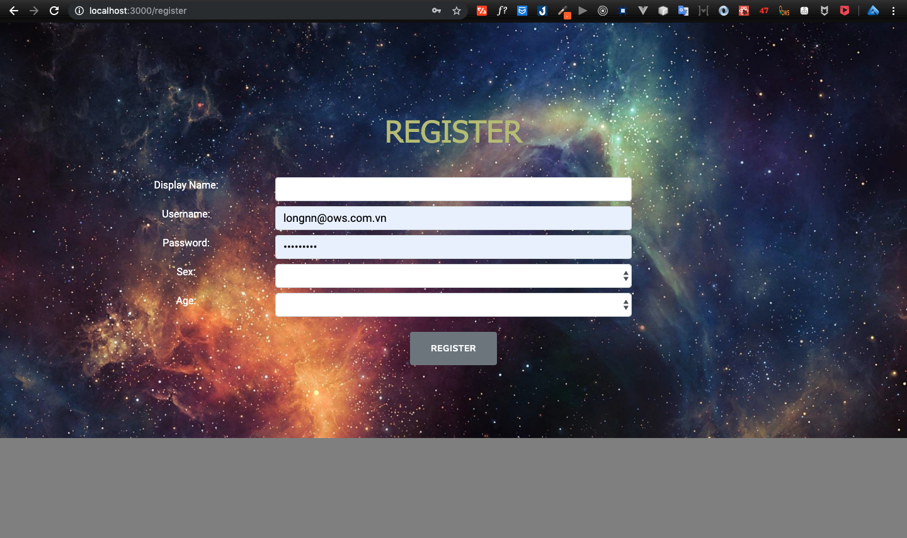
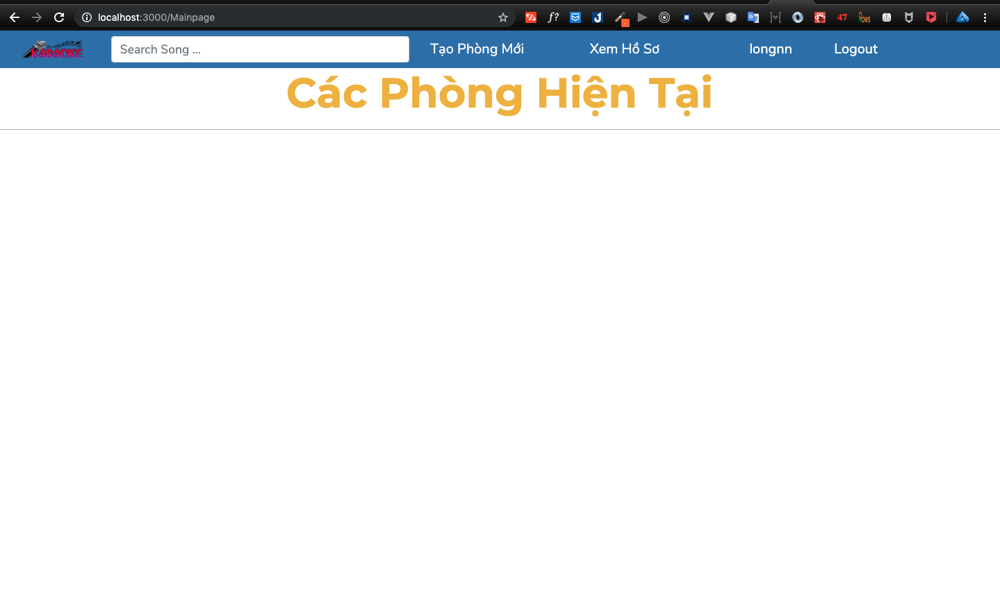
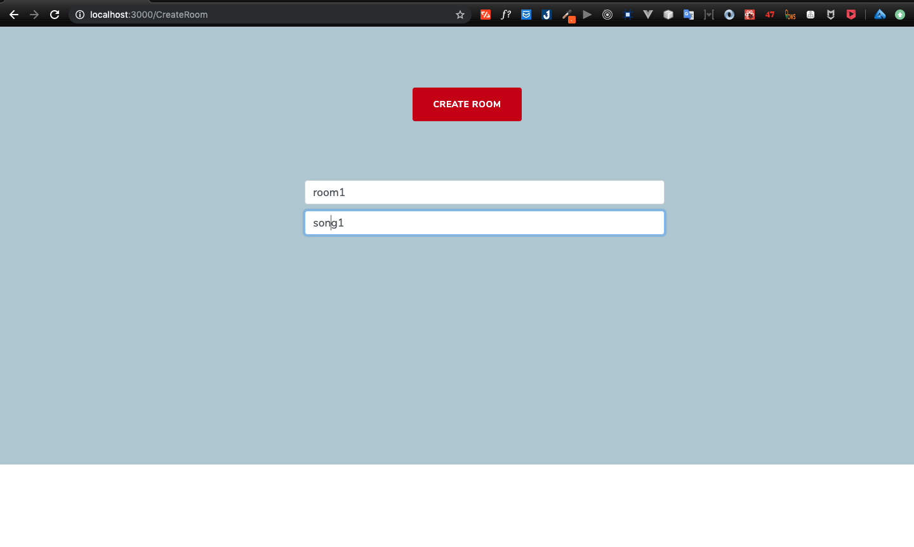

# Ứng dụng hát Karaoke online
> Ứng dụng nhằm mục đích tổ chức các cuộc thi đấu giọng ca trong 1 hội nhóm, mỗi người chỉ cần 1 chiếc máy tính hoặc điện thoại là có thể online và chơi được.

Ứng dụng sử dụng công nghệ 
[**NodeJS**](https://nodejs.org/en/) ,
[**MongoDB**](https://www.mongodb.com/what-is-mongodb) ,
[**ReactJS**](https://reactjs.org/) ,
[**WebRTC**](https://peerjs.com/) , 


## Installation

OS X & Linux & Window:

### Server
```sh
git clone https://github.com/chellongCoder/Karaoke-Online-Server
cd Karaoke-Online-Server
npm install 
npm start
```

### Client
```sh
git clone https://github.com/chellongCoder/Karaoke-Online-Client
cd Karaoke-Online-Client
npm install 
npm start
```

## Usage example

1. user truy cập vào http://localhost:3000 sau khi chạy npm start 

2. Nếu chưa có tài khoản thì kích vào nút đăng ký tài khoản

3. Ấn đăng ký tài khoản 
4. vào màn hình home 

5. ấn tạo phòng 

6. bật chế độ ẩn danh và test với 1 tài khoản khác 

